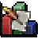

# Damage Tracker

## Info
Track and display the distribution of damage dealt to a user-defined target.  
You can edit the tracker to only function under specific conditions: equipment, attack style, skill levels and/or active prayers.

|Tracker example|Simulation reference|
|:-:|:-:|
|||
