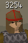

# Chat Success Rates

## Info
Track skilling success rates with game chat messages.

## Config options

- Add level prefix: ✅ `true`
  - Whether to add a skill level prefix/identifier to the tracked chat messages
- Use boosted level: ✅ `true`
  - Whether to use the boosted skill level (numerator) or the static base skill level (denominator)
- Level prefix: `Overall`
  - The skill level prefix/identifier on the tracked chat messages
- Success message: `        `
  - The chat message used to track a skilling action success
- Failure message: `        `
  - The chat message used to track a skilling action failure
